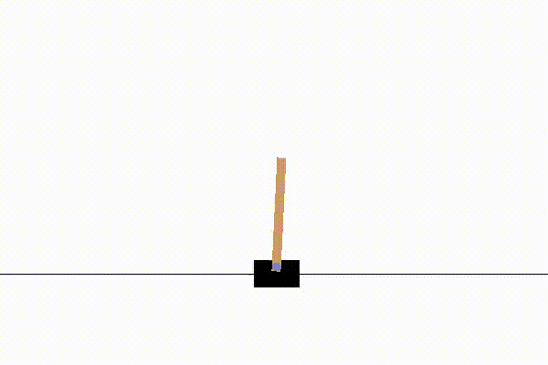

# Solving CartPole using Distributional RL

In this project,I implemented an agent that can learn to control a cartpole using C51 algorithm which is introduced by ["A Distributional Perspective on Reinforcement Learning"](https://arxiv.org/abs/1707.06887).Also I used double q-learning instead q-learning to keep stability during training.

# graph
</img>

# Final score(testing the agent)
It could achieve score of 195.19 over 100 episodes!

# Run on a single episode(reward=200)
</img>
